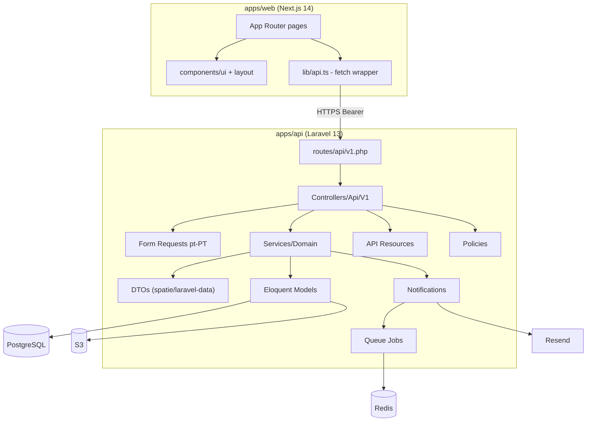

# Diagrama de Componentes

---

## Camadas

- **HTTP** — Routes + Controllers + FormRequests + Resources
- **Domínio** — Services (regras), DTOs, Eloquent Models
- **Infra** — Cache (Redis), Queue (Horizon), Storage (S3), Email (Resend)
- **Cross-cutting** — Activity Log (auditoria), Sentry (errors), Pulse (métricas)
