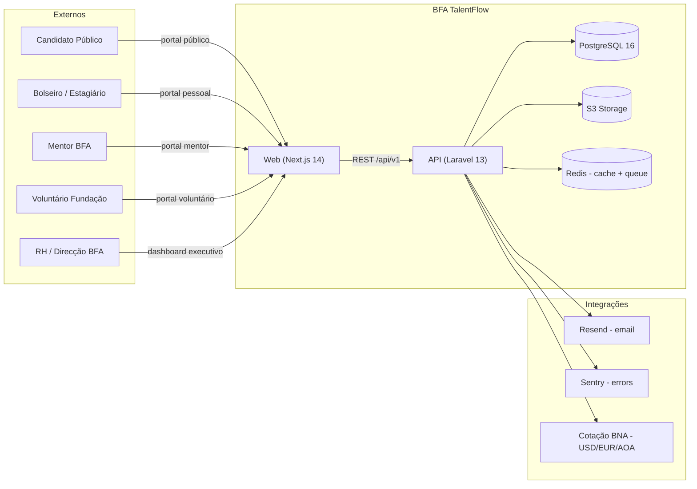

# Diagrama de Contexto

```mermaid
flowchart LR
    subgraph "Externos"
        Candidato[Candidato Público]
        Bolseiro[Bolseiro / Estagiário]
        Mentor[Mentor BFA]
        Voluntario[Voluntário Fundação]
        RH[RH / Direcção BFA]
    end

    subgraph "BFA TalentFlow"
        Web["Web (Next.js 14)"]
        API["API (Laravel 13)"]
        DB[(PostgreSQL 16)]
        S3[(S3 Storage)]
        Redis[(Redis - cache + queue)]
    end

    subgraph "Integrações"
        Resend[Resend - email]
        Sentry[Sentry - errors]
        BNA[Cotação BNA - USD/EUR/AOA]
    end

    Candidato -->|portal público| Web
    Bolseiro -->|portal pessoal| Web
    Mentor -->|portal mentor| Web
    Voluntario -->|portal voluntário| Web
    RH -->|dashboard executivo| Web

    Web -->|REST /api/v1| API
    API --> DB
    API --> S3
    API --> Redis
    API --> Resend
    API --> Sentry
    API --> BNA
```
