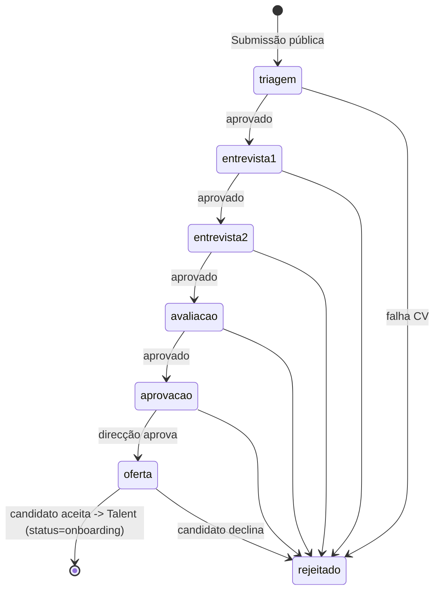
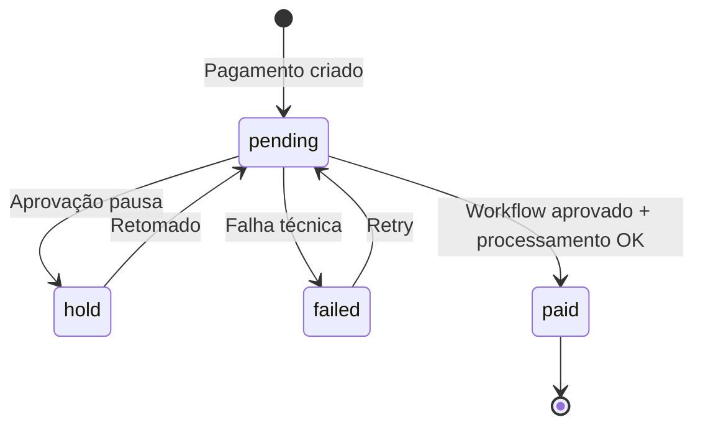

# Fluxos de Negócio

---

## 1. Candidatura → Integração



- Cada transição `POST /candidaturas/{id}/avancar` ou `/rejeitar`.
- Log automático em `activity_log`.
- Email ao candidato em todas as transições visíveis.

---

## 2. Pagamento



- `idempotency_key` obrigatório em `POST /pagamentos/{id}/processar`.
- Reprocessamento de SWIFT cria novo `Workflow` (ver `WF-2456`).

---

## 3. Workflow Multi-Step

```
step 1 (RH)        → submetido / pendente
step 2 (Mentor*)   → revisão técnica
step 3 (RH)        → revisão financeira
step 4 (Direcção)  → aprovação final
```

- *Step 2 só existe para tipos relacionados com talento (excepto batches).
- Cada step `POST /workflows/{id}/aprovar` (avança) ou `/rejeitar` (corta).
- Rejeição em qualquer step → workflow `rejected`, pagamento associado fica `hold`.

---

## 4. Falta

```
bolseiro/estagiario submete -> mentor revê (nota) -> RH aprova/rejeita
```

---

## 5. Voluntariado

```
voluntário inscreve-se em actividade -> coordenador valida presença ->
voluntário/coordenador regista horas -> RH/coord. valida -> total_horas++
```

---

## 6. Avaliação 360°

```
RH abre ciclo -> mentor + pares + auto-avaliação submetem ->
agregação -> sessão de feedback com mentor -> ciclo encerrado
```
